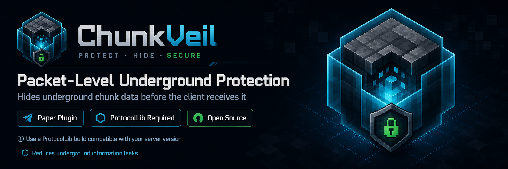
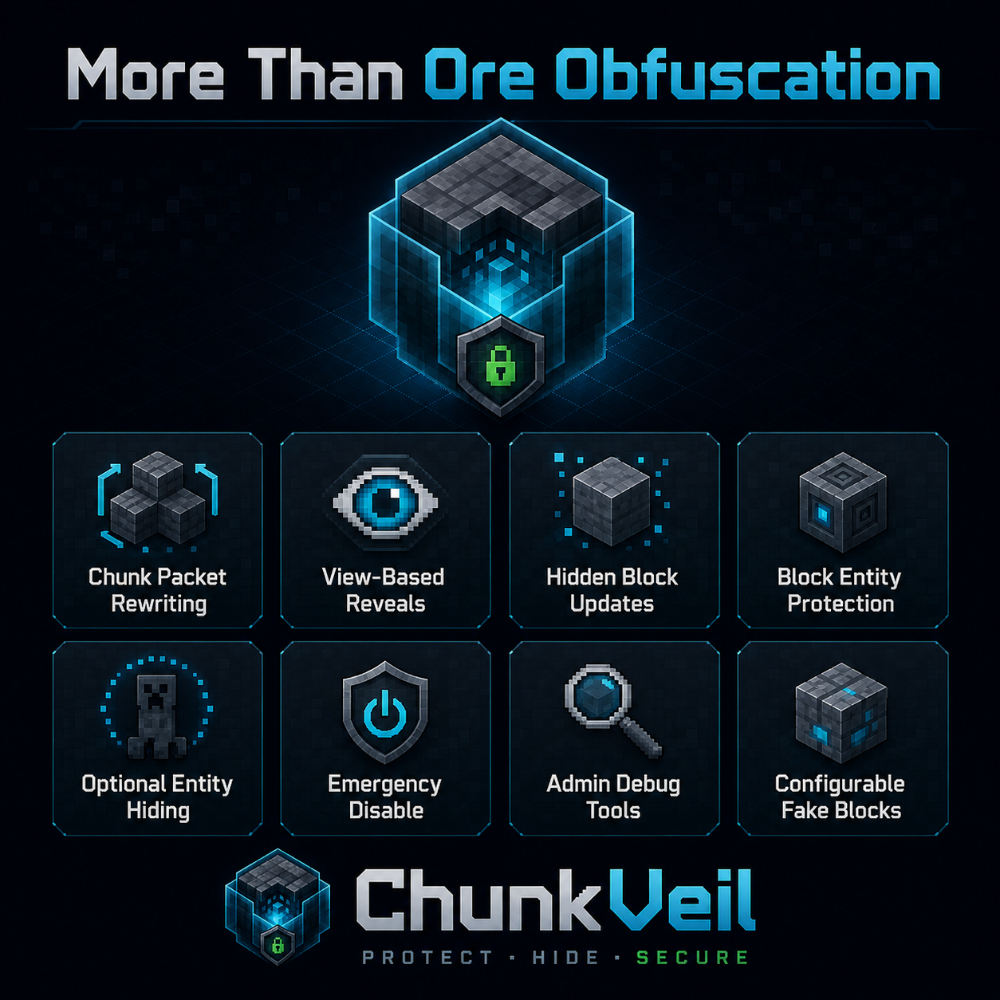
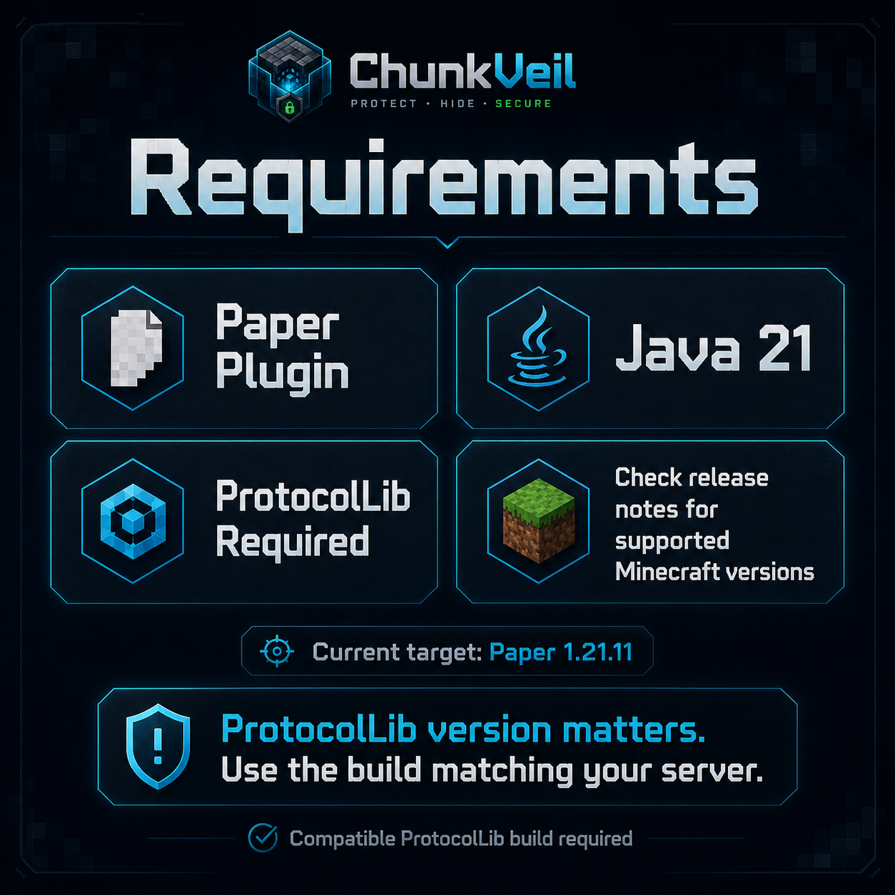
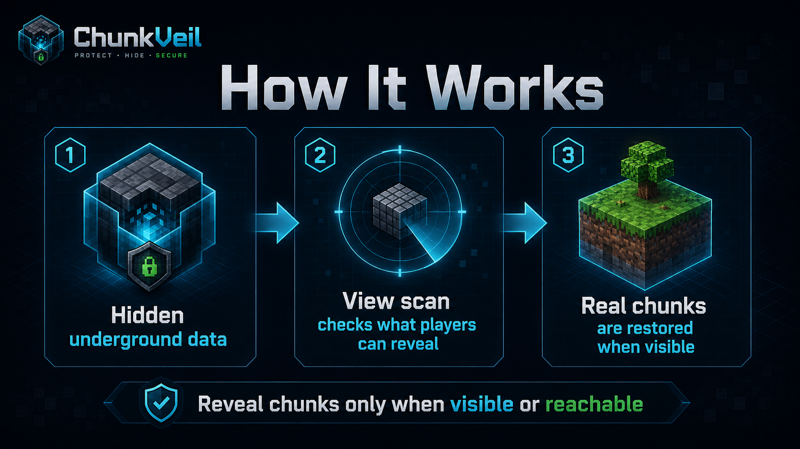

<p align="center">
  
</p>

# ChunkVeil

ChunkVeil is a free, open-source Paper + ProtocolLib plugin that helps reduce underground information leaks on Minecraft servers.

It hides underground chunk data before the client receives it, then reveals chunks only when the player can realistically see or reach them through a view-based scan. The goal is to protect more than ores: caves, hidden bases, underground rooms, block entities, entity spawns, and later block updates can all leak useful information to modified clients.

ChunkVeil reduces xray, ESP, freecam, hidden-base discovery, and PieChart-style underground leaks. It does not claim to make every hacked client impossible to use.

## Downloads

Download release jars from [GitHub Releases](https://github.com/DeKaeyman/ChunkVeil/releases).

For development builds, use the GitHub Actions artifact from the latest successful workflow run.

## Requirements

<p align="center">
  
</p>

- Paper 1.21.11
- Java 21
- ProtocolLib compatible with your Paper/Minecraft version

ProtocolLib version matters. Use the ProtocolLib build recommended for your server version:

https://www.spigotmc.org/resources/protocollib.1997/

ChunkVeil currently targets Paper 1.21.11. Support for other versions may be added later.

## Features

<p align="center">
  
</p>

- Rewrites outgoing chunk packets for hidden underground sections.
- Replaces hidden blocks with a configurable fake block.
- Reveals chunks using a 360-degree view scan instead of a simple distance radius.
- Keeps revealed chunks visible until they leave the player's render distance.
- Rewrites later block update packets while a chunk is hidden.
- Cancels hidden block entity update packets below the hidden Y range.
- Optionally hides underground entities.
- Includes admin commands, permissions, metrics, debug logging, reload/refresh, and emergency runtime disable.

## How It Works

<p align="center">
  
</p>

1. Underground data starts hidden from the player.
2. ChunkVeil scans what the player can reveal using view rays.
3. Real chunks are restored when they become visible or reachable.

ChunkVeil is primarily designed for the overworld. Nether and End can be configured, but they are disabled by default because their terrain and fake block choices usually need separate testing.

## Installation

1. Install Paper 1.21.11.
2. Install Java 21.
3. Install a ProtocolLib build compatible with Paper 1.21.11.
4. Put `ChunkVeil.jar` in your server's `plugins` folder.
5. Start the server once to generate `plugins/ChunkVeil/config.yml` and `plugins/ChunkVeil/lang.yml`.
6. Run `/chunkveil status` in-game or from console.

## Default Config

```yaml
view-reveal-horizontal-rays: 64
view-reveal-vertical-rays: 13
view-reveal-occlusion-grace-blocks: 2
view-reveal-refresh-millis: 150

worlds:
  world:
    enabled: true
    hide-below-y: 0
    min-y: -64
    default-fake-block: DEEPSLATE
    hide-air: false
    hide-entities: true
    hide-players: false
  world_nether:
    enabled: false
    hide-below-y: 32
    min-y: 0
    default-fake-block: NETHERRACK
    hide-air: false
    hide-entities: true
    hide-players: false
  world_the_end:
    enabled: false
    hide-below-y: 0
    min-y: -64
    default-fake-block: END_STONE
    hide-air: false
    hide-entities: true
    hide-players: false
```

## Config Notes

`hide-below-y`
Per-world setting. Blocks below this Y level are hidden. With `0`, blocks from `min-y` through `-1` are hidden.

`min-y`
Per-world setting. Lowest Y level ChunkVeil should process.

`default-fake-block`
Per-world setting. The block sent to the client for hidden real blocks. For overworld, `DEEPSLATE` is usually the safest choice.

`hide-air`
When `false`, air stays air and only non-air blocks are faked. This is faster and is the recommended default. When `true`, air is also replaced by the fake block, which hides caves and base layouts more aggressively but costs more.

`hide-entities`
Hides mobs, item drops, minecarts, armor stands, item frames, and similar entities below the hidden Y range when their chunk is hidden.

`hide-players`
Also hides players below the hidden Y range. Default is `false` because hiding players can affect PvP and moderation.

## Commands

`/chunkveil status`
Shows config state, packet rewrite status, tracked players, queued chunks, and metrics.

`/chunkveil reload`
Reloads config and language files, then refreshes online players.

`/chunkveil refresh`
Forces a refresh for all online players.

`/chunkveil disable`
Emergency switch. Stops packet/listener processing, shows hidden entities again, and refreshes sent chunks back to real world data for online players.

`/chunkveil enable`
Starts the runtime again after `/chunkveil disable`.

`/chunkveil debug on`
Logs a compact metrics summary every 30 seconds.

`/chunkveil debug off`
Disables debug summaries.

`/chunkveil version`
Shows the plugin version.

Alias: `/cv`

## Permissions

- `chunkveil.admin` - Allows all ChunkVeil admin commands.
- `chunkveil.status` - Allows `/chunkveil status`.
- `chunkveil.reload` - Allows `/chunkveil reload`.
- `chunkveil.refresh` - Allows `/chunkveil refresh`.
- `chunkveil.toggle` - Allows `/chunkveil disable` and `/chunkveil enable`.
- `chunkveil.debug` - Allows `/chunkveil debug on/off`.
- `chunkveil.bypass` - Bypasses all ChunkVeil hiding for that player.

## Performance Notes

The recommended default is `hide-air: false`. It avoids rewriting huge amounts of cave air and is much lighter.

Most CPU cost happens when players receive new chunks, move into new chunks, or reveal hidden areas. Idle players should be cheap.

Use `/chunkveil status` for quick counters and `/spark profiler start --timeout 600` for real profiling on a live server.

## Bug Reports

Please use [GitHub Issues](https://github.com/DeKaeyman/ChunkVeil/issues) and include:

- ChunkVeil version
- Paper version
- ProtocolLib version
- Full startup log or relevant error log
- Config file
- Steps to reproduce
- Whether the issue happens with only ChunkVeil and ProtocolLib installed

## License

ChunkVeil is licensed under the MIT License. See [LICENSE](LICENSE).
