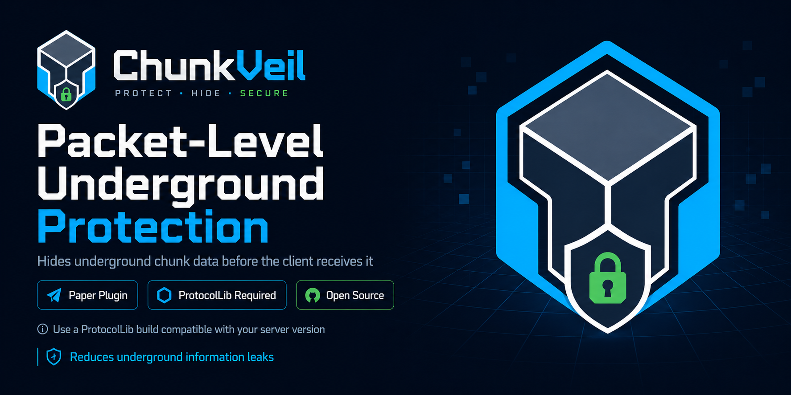
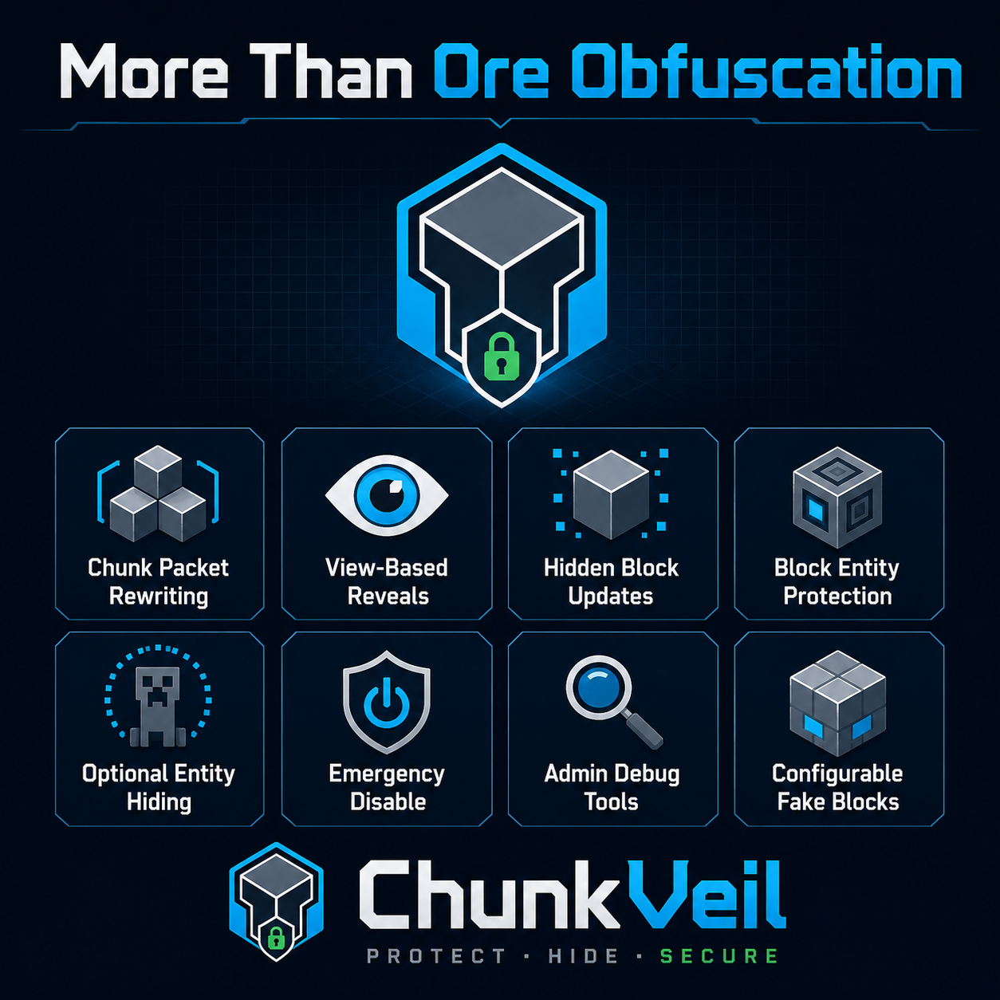
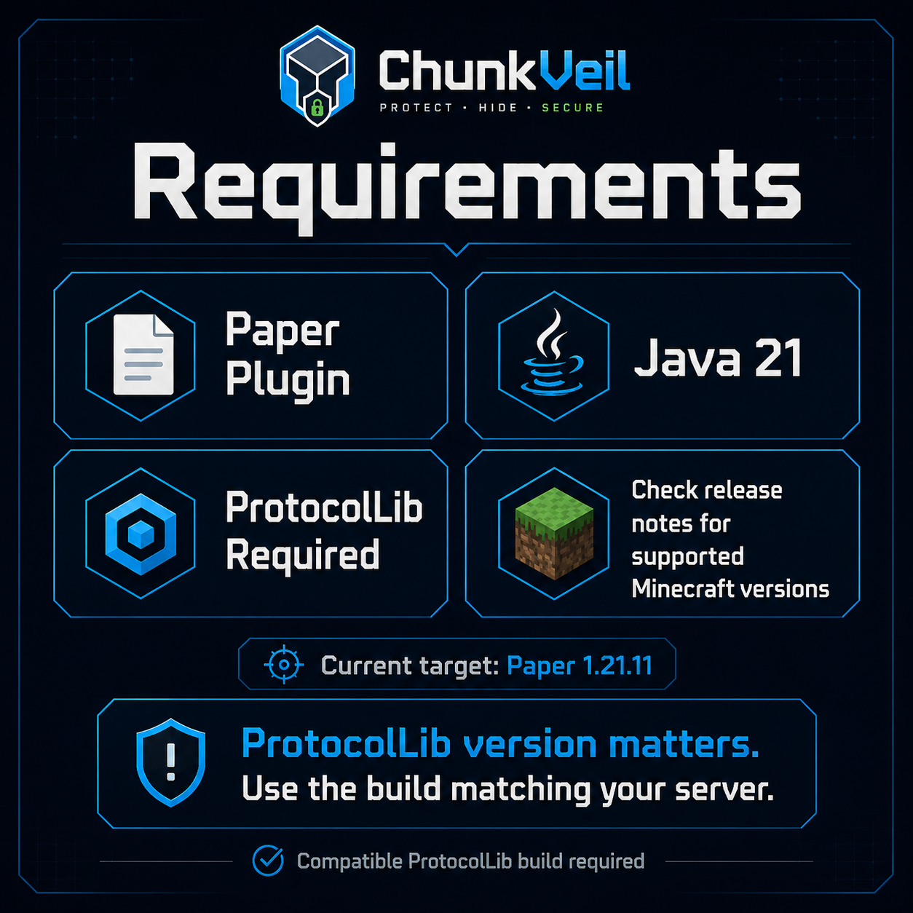
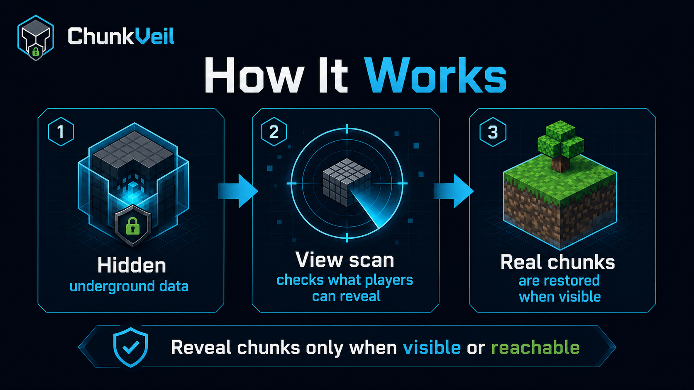
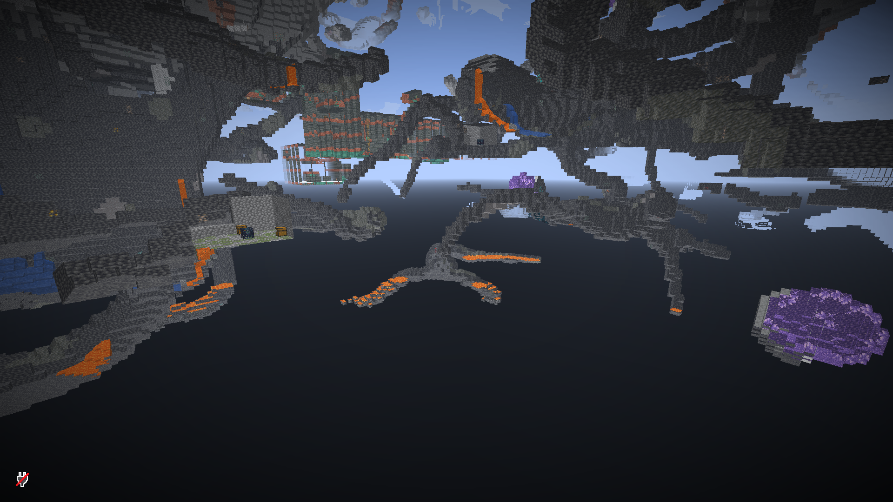
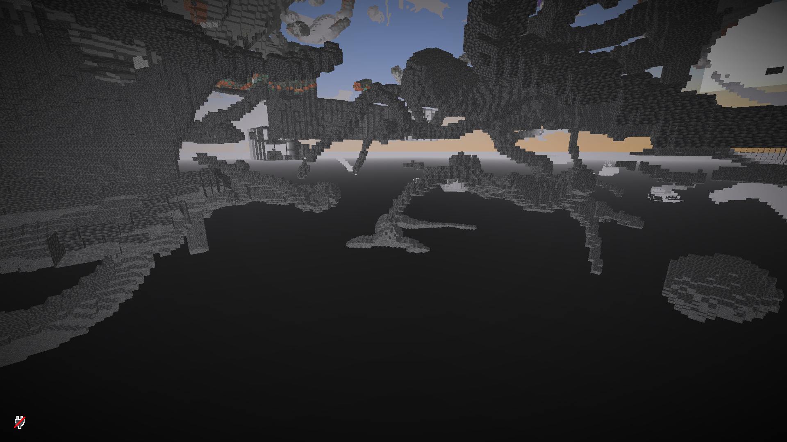
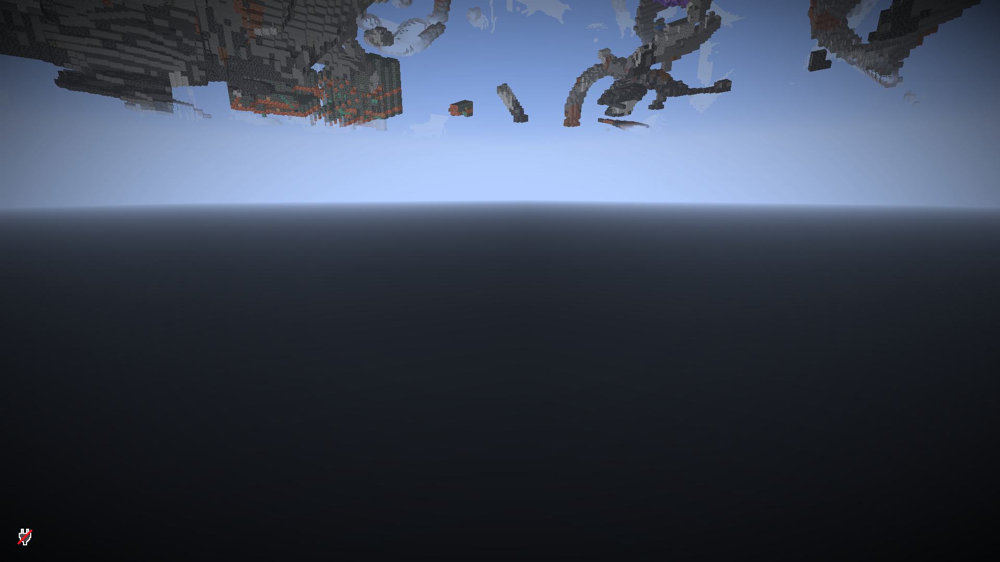

<p align="center">
  
</p>

# ChunkVeil

ChunkVeil is a free, open-source Paper + ProtocolLib plugin that helps reduce underground information leaks on Minecraft servers.

It hides underground chunk data before the client receives it, then reveals chunks only when the player can realistically see or reach them through a view-based scan. The goal is to protect more than ores: caves, hidden bases, underground rooms, block entities, entity spawns, and later block updates can all leak useful information to modified clients.

ChunkVeil reduces xray, ESP, freecam, hidden-base discovery, and PieChart-style underground leaks. It does not claim to make every hacked client impossible to use.

## Downloads

Download release jars from [GitHub Releases](https://github.com/DeKaeyman/ChunkVeil/releases).

For development builds, use the GitHub Actions artifact from the latest successful workflow run.

## Requirements

<p align="center">
  
</p>

- Paper 1.21.x or 26.x
- Java 21 or newer (Paper 26.x itself requires Java 25)
- ProtocolLib compatible with your Paper/Minecraft version

ProtocolLib version matters. Pick the build that matches your server version:

- Paper 1.21.4 - 1.21.8: [ProtocolLib 5.4.0](https://github.com/dmulloy2/ProtocolLib/releases) (stable release)
- Paper 1.21.9 - 1.21.11 and 26.x: the newest ProtocolLib release or [development build](https://github.com/dmulloy2/ProtocolLib) that lists your exact version ([Hangar versions](https://hangar.papermc.io/dmulloy2/ProtocolLib/versions), [SpigotMC page](https://www.spigotmc.org/resources/protocollib.1997/))

## Compatibility

ChunkVeil ships as a single universal jar. **Verified** means this exact combination was run on a real server with this ChunkVeil release. **Expected** means it should work but was not run before release — reports are welcome either way.

| Server | ProtocolLib | Java | Status |
| --- | --- | --- | --- |
| Paper 26.1.2 | newest dev build for 26.1 | 25 | Verified (ChunkVeil 0.5.0) |
| Paper 1.21.11 | newest build for 1.21.11 | 21+ | Verified (ChunkVeil 0.5.0) |
| Paper 1.21.8 | 5.4.0 | 21+ | Verified (ChunkVeil 0.5.0) |
| Other Paper 1.21.x | matching build for that version | 21+ | Expected, not verified |
| Paper 26.2 | matching ProtocolLib development build | 25 | Expected, not manually verified |
| Other Paper 26.x | matching dev build for that version | 25 | Expected, not verified |
| Spigot, Folia, pre-1.21 | - | - | Unsupported |

If a combination marked *expected* misbehaves, ChunkVeil is designed to fail closed rather than leak (see [Protection Model](#protection-model)), and `/chunkveil verify` will tell you what went wrong.

The next-snapshot [checksum-pinned compatibility matrix](docs/COMPATIBILITY.md) boots exact Paper and ProtocolLib artifacts in CI. Compatibility and release values come from the canonical [`release-metadata.json`](release-metadata.json), preventing the build, CI matrix, and update manifest from drifting apart. Rows remain pending until their real-server jobs pass.

## Features

<p align="center">
  
</p>

- Rewrites outgoing chunk packets for hidden underground sections before they are sent; unsafe packets are cancelled instead of sent (fail-closed).
- Replaces hidden blocks with a configurable fake block.
- Reveals chunks using a 360-degree view scan instead of a simple distance radius.
- Keeps revealed chunks visible until they leave the player's render distance.
- Rewrites later block update packets while a chunk is hidden.
- Cancels hidden block entity update packets below the hidden Y range.
- Optionally hides underground entities.
- Includes admin commands, permissions, metrics, debug logging, reload/refresh, and emergency runtime disable.
- Ships an automated packet regression test suite (run in CI); exact coverage and boundaries are documented in [docs/COVERAGE.md](docs/COVERAGE.md).
- `/chunkveil verify` gives owners a single PASS/WARN/FAIL protection check, and a public protection-status event lets monitoring plugins track it.
- Notifies admins in-game when a newer release compatible with the server's Minecraft version is available.
- Reports anonymous aggregate usage statistics through bStats (opt-out).

## How It Works

<p align="center">
  
</p>

1. Underground data starts hidden from the player.
2. ChunkVeil scans what the player can reveal using view rays.
3. Real chunks are restored when they become visible or reachable.

ChunkVeil is primarily designed for the overworld. Nether and End can be configured, but they are disabled by default because their terrain and fake block choices usually need separate testing.

## Protection Model

ChunkVeil's core rule is simple: **while protection is active, a hidden chunk never leaves the server with real underground block data in it.** Outgoing chunk packets for protected worlds are rewritten before they are sent. Block states, block entities, and concealed light are prepared on a cloned packet and published together only after every step succeeds.

Failure behavior depends on when and why protection stops:

- **Startup failure:** with the default strict startup policy, the server is stopped if ChunkVeil cannot initialize protection.
- **Runtime security trip:** the triggering packet is cancelled immediately, the listener enters an atomic `TRIPPED` state, and subsequent protected packet traffic is quarantined. Real chunks are not restored and the running server is not stopped.
- **Administrator disable:** `/chunkveil disable` is an explicit operational choice and restores real chunks before removing protection.

There is no automatic insecure fallback after a parser or rewriter failure. See the [strict confidentiality preset](docs/STRICT-PRESET.md) for the strongest supplied configuration posture.

What this deliberately does **not** cover:

- Terrain above your configured `hide-below-y` cutoff. Out of scope by design.
- Cave and tunnel shapes when `hide-air: false` (the default). Air stays air for performance; enable `hide-air: true` to conceal shapes as well.
- Plugins that rewrite the same packets after ChunkVeil. Test your exact stack.
- Combat, movement, or other gameplay cheats. ChunkVeil is not an anti-cheat.
- World-seed inference from visible terrain and structures. Use separate seed-protection tooling if required.
- Light in the single section crossed by a non-16-aligned cutoff. Align `hide-below-y` to a multiple of 16 to close that edge.

The full packet-by-packet coverage table, including verification method and known boundaries, is in [docs/COVERAGE.md](docs/COVERAGE.md).

## Developer API

ChunkVeil fires `com.dekaeyman.chunkveil.api.VeilProtectionStatusEvent` on the main thread whenever runtime protection starts, is disabled by an admin, or fails closed. Monitoring plugins can listen to it to alert when the server is loaded but not protected.

## Visual Comparison

These screenshots use an xray-style view so the difference is easy to see.

### Without ChunkVeil

<p align="center">
  
</p>

With ChunkVeil disabled, underground terrain, caves, ores, structures, and hidden spaces can be visible to modified clients before the player should know about them.

### ChunkVeil with `hide-air: false`

<p align="center">
  
</p>

This is the recommended default. Air stays air, so caves and empty pockets may still appear as open space, but solid hidden blocks are replaced with the configured fake block, such as `DEEPSLATE`. This is faster and reduces the most useful block information without rewriting huge amounts of air.

### ChunkVeil with `hide-air: true`

<p align="center">
  
</p>

When `hide-air` is enabled, ChunkVeil also replaces underground air with the fake block. This makes cave shapes, rooms, and hidden base layouts much harder to read from the client side, but it costs more because many more blocks need to be rewritten.

## Installation

1. Install Paper 1.21.x or 26.x.
2. Install Java 21 or newer (Java 25 for Paper 26.x).
3. Install a ProtocolLib build compatible with your Paper version (see [Compatibility](#compatibility)).
4. Put `ChunkVeil.jar` in your server's `plugins` folder.
5. Start the server once to generate `plugins/ChunkVeil/config.yml` and `plugins/ChunkVeil/lang.yml`.
6. Run `/chunkveil status` in-game or from console.

## Default Config

```yaml
security:
  stop-server-on-startup-failure: true

worlds:
  world:
    enabled: true
    hide-below-y: 0
    min-y: -64
    default-fake-block: DEEPSLATE
    hide-air: false
    hide-entities: true
    hide-players: false
  world_nether:
    enabled: false
    hide-below-y: 32
    min-y: 0
    default-fake-block: NETHERRACK
    hide-air: false
    hide-entities: true
    hide-players: false
  world_the_end:
    enabled: false
    hide-below-y: 0
    min-y: -64
    default-fake-block: END_STONE
    hide-air: false
    hide-entities: true
    hide-players: false

view-reveal-front-horizontal-rays: 10
view-reveal-side-horizontal-rays: 5
view-reveal-back-horizontal-rays: 3
view-reveal-vertical-rays: 10
view-reveal-occlusion-grace-blocks: 2
view-reveal-refresh-millis: 150

performance:
  max-priority-chunk-updates-per-player-per-tick: 24
  max-regular-chunk-updates-per-player-per-tick: 1
  entity-scan-interval-millis: 500
  entity-scan-max-entities-per-player: 256

packet-protection:
  cancel-explosions: true
  cancel-world-events: true
  cancel-block-crack: true
  cancel-positional-sounds: true
  cancel-particles: true
  cancel-vibrations: true
  sanitize-light: true

update-checker:
  enabled: true
  interval-hours: 6
  notify-in-game: true

metrics:
  enabled: true
```

The generated `config.yml` also contains advanced tuning keys (forced rescan intervals, movement/yaw/pitch scan-skip thresholds, yaw direction caching, and optional TPS-adaptive scan quality) with inline documentation.

## Config Notes

`hide-below-y`
Per-world setting. Blocks below this Y level are hidden. With `0`, blocks from `min-y` through `-1` are hidden.

`min-y`
Per-world setting. Lowest Y level ChunkVeil should process.

`default-fake-block`
Per-world setting. The block sent to the client for hidden real blocks. For overworld, `DEEPSLATE` is usually the safest choice.

`hide-air`
When `false`, air stays air and only non-air blocks are faked. This is faster and is the recommended default. When `true`, air is also replaced by the fake block, which hides caves and base layouts more aggressively but costs more.

`hide-entities`
Hides mobs, item drops, minecarts, armor stands, item frames, and similar entities below the hidden Y range when their chunk is hidden.

`hide-players`
Also hides players below the hidden Y range. Default is `false` because hiding players can affect PvP and moderation.

`view-reveal-front/side/back-horizontal-rays`
Reveal rays are weighted toward the player's view direction: front > sides > back. More rays give more accurate reveals at a higher CPU cost per scan.

`view-reveal-vertical-rays`
Vertical spread of each horizontal ray direction.

`view-reveal-occlusion-grace-blocks`
How many solid occluding blocks a ray may pass through before stopping. `0` is strict line-of-sight; `2` reduces visible pop-in.

`packet-protection`
Cancels secondary packets (explosions, world events, block-crack animations, positional sounds, particles, and vibrations) that originate inside hidden underground zones. It also replaces light arrays for fully concealed sections with darkness. These only affect what the watching client receives, never the server world.

`security.stop-server-on-startup-failure`
When `true` (the default), ChunkVeil stops the server during boot if mandatory protection cannot initialize. It never stops the server for a runtime packet failure; runtime failures quarantine protected traffic instead.

## Compatibility With Anti-Xray

ChunkVeil can run alongside Paper's built-in anti-xray and packet-based plugins such as Orebfuscator. Paper anti-xray usually runs before ProtocolLib sees the outgoing chunk packet, and ChunkVeil then applies its underground hiding pass to the packet the player is about to receive.

ChunkVeil's ProtocolLib listener uses a late packet priority and declares Orebfuscator as an optional soft dependency so, when both plugins are installed, ChunkVeil is more likely to apply its hidden-chunk rewrite after other packet modifiers. Hidden chunks and hidden block updates are still rewritten for players who already have the chunk loaded.

When another plugin also rewrites the same chunk, block-change, or multi-block-change packets after ChunkVeil, that plugin may change the final fake block appearance. It should not reveal real underground blocks unless that plugin deliberately restores real block data. For the strictest protection, test your exact plugin stack with `/chunkveil status`, an xray/freecam client, and both `hide-air: false` and `hide-air: true` depending on how much cave/base shape you want to conceal.

## Commands

`/chunkveil status`
Shows config state, packet rewrite status, tracked players, queued chunks, and metrics.

`/chunkveil verify`
One PASS/WARN/FAIL verification of the whole protection state. It distinguishes a listener that is merely **INITIALIZED** from packet paths **EXERCISED** successfully on this running server, reports a `TRIPPED` quarantine, and shows category health for terrain, block data, entities, effects/game events, sounds, and lighting. It also checks versions, worlds, packet modifiers, and configuration. `/chunkveil compat` is an alias.

`/chunkveil inspect <player>`
Shows a player's current ChunkVeil state: visible chunks, queued updates, hidden entities, view distance, and bypass state.

`/chunkveil report`
Creates a sanitized diagnostic report under `plugins/ChunkVeil/reports/` with versions, a configuration checksum, protected-world settings, per-packet-path health, counters, timings, plugin-stack versions, and anonymized runtime state. It omits player names, addresses, and coordinates.

`/chunkveil predict <players> <ramGb> <cpuTier> [viewDistance]`
Produces an **experimental current-workload estimate** from live average timings and fixed activity assumptions. It is useful for comparing settings, but it is not a benchmark or guaranteed player-capacity figure; test representative peak activity before sizing a production server.

`/chunkveil reload`
Reloads config and language files, then refreshes online players.

`/chunkveil reload --check`
Dry run: validates `config.yml` from disk (including YAML syntax errors) and reports warnings without applying anything.

`/chunkveil refresh`
Forces a refresh for all online players.

`/chunkveil disable`
Emergency switch. Stops packet/listener processing, shows hidden entities again, and refreshes sent chunks back to real world data for online players.

`/chunkveil enable`
Starts the runtime again after `/chunkveil disable`.

`/chunkveil debug on`
Logs a compact metrics summary every 30 seconds.

`/chunkveil debug off`
Disables debug summaries.

`/chunkveil update`
Checks the update manifest now and reports whether a newer compatible release exists.

`/chunkveil version`
Shows the plugin version.

Alias: `/cv`

## Permissions

- `chunkveil.admin` - Allows all ChunkVeil admin commands.
- `chunkveil.status` - Allows `/chunkveil status`.
- `chunkveil.verify` - Allows `/chunkveil verify`.
- `chunkveil.inspect` - Allows `/chunkveil inspect <player>`.
- `chunkveil.report` - Allows `/chunkveil report`.
- `chunkveil.predict` - Allows `/chunkveil predict`.
- `chunkveil.reload` - Allows `/chunkveil reload`.
- `chunkveil.refresh` - Allows `/chunkveil refresh`.
- `chunkveil.toggle` - Allows `/chunkveil disable` and `/chunkveil enable`.
- `chunkveil.debug` - Allows `/chunkveil debug on/off`.
- `chunkveil.version` - Allows `/chunkveil version`.
- `chunkveil.update` - Allows `/chunkveil update` and receives update notices on join.
- `chunkveil.bypass` - Bypasses all ChunkVeil hiding for that player.

## Update Checker

ChunkVeil periodically reads a small version manifest ([update.json](update.json)) from this repository and reports newer releases that declare compatibility with the server's exact Minecraft version. Incompatible releases are never offered. Admins with `chunkveil.update` get a clickable download link on join, and `/chunkveil update` checks on demand.

The checker only reads version metadata. It never downloads or installs anything, and it never affects the protection runtime. Disable it with `update-checker.enabled: false` in `config.yml`. See [docs/UPDATE-MANIFEST.md](docs/UPDATE-MANIFEST.md) for the manifest format.

## Usage Statistics

ChunkVeil reports anonymous aggregate usage statistics through [bStats](https://bstats.org): server count, player counts, Minecraft/Java versions, and a few ChunkVeil-specific charts such as hide-air posture. No world data, no player data, and no server address is ever sent.

Opt out with `metrics.enabled: false` in `config.yml`, or globally for all plugins in `plugins/bStats/config.yml`.

## Performance Notes

The recommended default is `hide-air: false`. It avoids rewriting huge amounts of cave air and is much lighter.

Most CPU cost happens when players receive new chunks, move into new chunks, or reveal hidden areas. Idle players should be cheap.

Use `/chunkveil status` for quick counters and `/spark profiler start --timeout 600` for real profiling on a live server.

## Bug Reports

Please use [GitHub Issues](https://github.com/DeKaeyman/ChunkVeil/issues) and include:

- ChunkVeil version
- Paper version
- ProtocolLib version
- Full startup log or relevant error log
- Config file
- Steps to reproduce
- Whether the issue happens with only ChunkVeil and ProtocolLib installed

## License

ChunkVeil is licensed under the MIT License. See [LICENSE](LICENSE).
